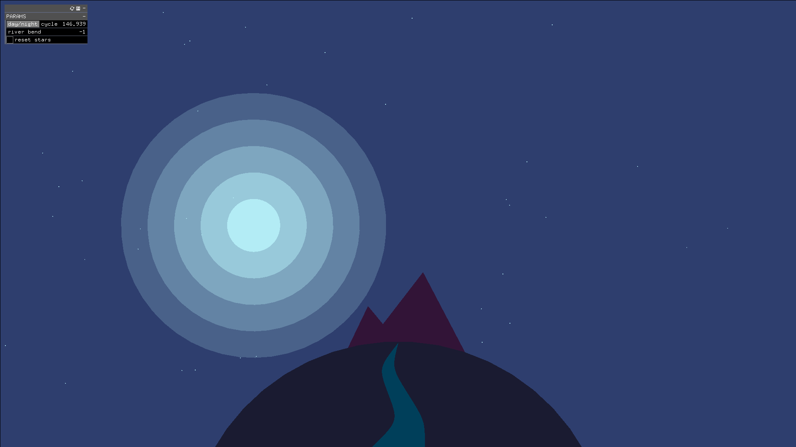

# Minimalist Landscapes




A series of generated landscapes using a flat minimalist style.

# Process

Recently, I've been messing around with Illustrator and vector art a lot, so the mindset of working with simple shapes and paths definitely influenced how I approached these landscapes. Initially, I really had no coherent idea or plan for the project; instead, I relied on loose experimentation to figure out what I wanted to make. I also had expected that my end result would be a lot more abstract and "generative," but after working on the composition it ended up being much more representational.

An aesthetic choice to note is the usage of semitransparent circles to represent sun/moon light. When working on the piece, I had envisioned highlight/shadow values changing depending on the position of the sun/moon. However, I realized that by using the circles to light the scene for me, I wouldn't have to go through the trouble of implementing a new lighting system.

# Compile

```
make && make run

```
# Options

* **Day/Night Cycle**: Changes position of sun/moon in the sky. Also affects lighting and coloring of objects in the scene.
* **River Bend**: Changes how the river flows via bezier curve transformations.
